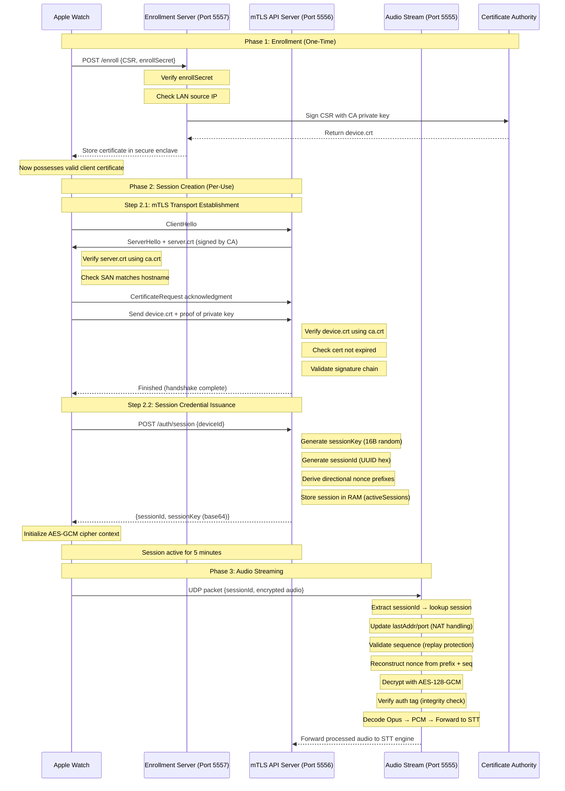

## Usecase Video

https://github.com/user-attachments/assets/0c7a534d-6e11-430d-b19b-bd94054ea123


## Communication Pipeline


## Table of Contents
[Usecase Video](#usecase-video)

[Communication Pipeline](#communication-pipeline)

1. [Introduction: From Security Theory to Practical Implementation](#1-introduction-from-security-theory-to-practical-implementation)

    1.1 [Why Apple Watch?](#11-why-apple-watch)

    1.2 [Overall Context](#12-overall-context)

    1.3 [Threat Model](#13-threat-model)

2. [Server Port Architecture and Access Control](#2-server-port-architecture-and-access-control)

    2.1 [Enrollment is the Root of Trust](#21-enrollment-is-the-root-of-trust)

    2.2 [Why LAN-Only Enrollment?](#22-why-lan-only-enrollment)

    2.3 [Port 5556: The mTLS Gatekeeper](#23-port-5556-the-mtls-gatekeeper)

    2.4 [Access Control: What Happens Without Enrollment?](#24-access-control-what-happens-without-enrollment)

    2.5 [Cryptographic Binding of UDP Packets](#25-cryptographic-binding-of-udp-packets)

    2.6 [Certificate Roles](#26-certificate-roles)

3. [AES-128-GCM & Nonce Management](#3-aes-128-gcm--nonce-management)

    3.1 [Why AES-128-GCM?](#31-why-aes-128-gcm)

    3.2 [Nonce Derivation](#32-nonce-derivation)

4. [UDP Security](#4-udp-security)

    4.1 [Why UDP for Real-Time Audio?](#41-why-udp-for-real-time-audio)

    4.2 [Packet Structure & Replay Protection](#42-packet-structure--replay-protection)

    4.3 [Heartbeat Mechanism for NAT Traversal](#43-heartbeat-mechanism-for-nat-traversal)

5. [Session Management: Ephemeral Keys & Lifecycle Control](#5-session-management-ephemeral-keys--lifecycle-control)

    5.1 [Session Key Derivation & Binding](#51-session-key-derivation--binding)

    5.2 [Directional Nonce Prefixes](#52-directional-nonce-prefixes)

    5.3 [Session Pruning](#53-session-pruning)

[Conclusion](#conclusion)

[Future Directions](#future-directions)

[Resources](#resources)


## 1. Introduction: From Security Theory to Practical Implementation
This project originated from two converging obervations during my SANS GSEC certification studies.

1. Implementation Gap: Many security frameworks teach what to protect but rarely demonstrate how to implement cryptographic controls in resource-constrained, realtime systems. I wanted to bridge this gap by building a system where every security decision from certificate pinning to nonce derivation is justified, documented, and tested.

2. Voice first UX opportunity: With the recent explosion of popularity in projects like openclaw, I noticed a painpoint: users must still type their requests into chat interfaces. This leads to slow interaction and excludes scenarios where hands-free operation is essential.

So I set out to create a voice-native assistant that lives on the apple watch, while maintaining enterprise-grade cryptographic security guarantees. 

##### 1.1 Why Apple Watch?
Apple watch hardware provides benefits:
* Built in voice-processing I/O allowing echo cancellation of audio data from speakers bleeding into the mic
* Secure enclave
* Supports gestures like double tap (index finger) for low friction operation
* Battery efficient native VAD (voice activity detection) that allows for audio data to be sent to server only when needed. This is huge for battery saving.


##### 1.2 Overall Context
My home server enables real-time audio streaming to and from Apple Watch and performs speech-to-text (STT), small-language model (SLM), as well as text-to-speech (TTS) processing. 

* __Platform limitations:__ watchOS restricts low level networking calls (TLS socket and UDP). `NWConnection` (via CallKit) is required for mutual TLS (mTLS). CallKit UI is also very restrictive on watchOS and cannot be customized. 
* __Latency sensitivity:__ Audio processing demands sub 100ms roundtrip times, favoring UDP over TCP for media transport.
* __Resource constraints:__ Watch battery life and CPU limit cryptographic overhead.


##### 1.3 Threat Model
We assume an adversary capable of:
* Passive eavesdropping on network traffic (Wi-Fi, cellular, LAN)
* Active packet injection, modification, or replay
* Compromise of client application code (but not hardware secure enclave)
* DNS spoofing or BGP hijacking targeting dynamic DNS endpoints

We explicitly exclude:
* Physical device theft with unlocked secure enclave access
* Server-side compromise (addressed via separate hardening practices)
* Quantum computing attacks (post-quantum cryptography is out of scope)

## 2. Server Port Architecture and Access Control
__PORT  5557 (HTTPS/TLS)__ 
* __Access Scope:__ LAN only (`process.env.LOCAL_IP`)
* __Purpose:__ One time device enrollment and certificate issuance. `device.crt` is stored in the Keychain
* __Authentication:__ Server and watch share an `enrollSecret`

__PORT 5556 (HTTPS/mTLS)__
*This port is port-forwarded by my router.*
* __Access Scope:__ Accessible via public IP address (DuckDNS)
* __Purpose:__ Session key exchange and lifecycle management
* __Authentication:__ `device.crt` Client certificate (from enrollment) is signed with a private key inside the watch's Secure Enclave and presented to server during TLS handshake to authenticate the watch

__PORT 5555 (UDP)__
*This port is port-forwarded by my router.*
* __Access Scope:__ Accessible via public IP address (DuckDNS) 
* __Purpose:__ Real-time audio streaming
* __Authentication:__ Session ID + cryptographic authentication

##### 2.1 Enrollment is the root of trust
__Enrollment__ is a one-time device onboarding process the issues a cryptographically-signed X.509 client certificate, establishing the device's long-term identity within the server.
```js
// Enrollment server (port 5557) - LAN-only
const enrollServer = Bun.serve({
  hostname: process.env.LOCAL_IP, // ⚠️ Not exposed to internet
  port: 5557,
  tls: {
    cert: Bun.file("./certs/server.crt"),
    key: Bun.file("./certs/server.key"),
  },
  async fetch(req) {
    const url = new URL(req.url);
    if (url.pathname === "/enroll" && req.method === "POST") {
      const { csr, enrollSecret } = await req.json();
      
      // 🔐 First gate: Shared secret verification
      if (enrollSecret !== process.env.ENROLL_SECRET) {
        return new Response("unauthorized", { status: 401 });
      }

      // Sign CSR with CA private key
      await $`openssl x509 -req \
        -in /tmp/device.csr \
        -CA ./certs/ca.crt \
        -CAkey ./certs/ca.key \
        -CAcreateserial \
        -out /tmp/device.crt \
        -days 825 \
        -sha256`;
      
      const signedCert = await Bun.file("/tmp/device.crt").text();
      return new Response(JSON.stringify({ cert: signedCert }), { status: 200 });
    }
  }
});
```

##### 2.2 Why LAN-Only Enrollment?
* Requires physical proximity.
* Enrollment endpoint is manually controlled. Only available in LAN if server has it enabled.

##### 2.3 Port 5556: The mTLS Gatekeeper

mTLS (mutual TLS) extends standard TLS by requiring both client and server to present and validate X.509 certificates, establishing bidirectional identity proof.

Port 5556 is the only entry point for session creation, and it enforces mutual TLS authentication at the transport layer before any application logic executes.

```js
// Main API server (port 5556) - Public-facing but mTLS-guarded
const server = Bun.serve({
  hostname: '0.0.0.0', 
  port: 5556,
  tls: {
    cert: Bun.file("./certs/server.crt"),
    key: Bun.file("./certs/server.key"),
    ca: Bun.file("./certs/ca.crt"),
    requestCert: true,        // Require client certificate
    rejectUnauthorized: true, // Reject if cert not signed by CA
  },
  async fetch(req, server) {
    const url = new URL(req.url);

    // /auth/session — mTLS already verified identity at transport layer
    if (url.pathname === "/auth/session" && req.method === "POST") {
      // At this point, we already know:
      // 1. Client possesses a valid certificate signed by our CA
      // 2. Certificate hasn't expired
      // 3. Private key corresponds to the certificate's public key
      
      const sessionKey = crypto.randomBytes(16);
      const sessionId = crypto.randomUUID().replace(/-/g, "");
      
      // Extract device identity from mTLS certificate
      const body = await req.json();
      const pubkey = body.deviceId; // Cross-reference with enrolled devices
      
      activeSessions.set(sessionId, {
        pubkey: pubkey,
        sessionKey: sessionKey,
        // ... session metadata
      });
      
      return new Response(
        JSON.stringify({ sessionId, sessionKey: sessionKey.toString("base64") }),
        { status: 200 }
      );
    }
  }
});
```


##### 2.4 Access Control: What Happens Without Enrollment?

When there is no certificate, port 5556 blocks access and TLS handshake fails. No valid sessionID.

When there is incorrect CA, `enrollSecret` check fails. Port 5556 blocks access `rejectUnauthorized`. No valid SessionID.

When there is Expired certificate, the watch must re-enroll.

When there is valid cert, no session, can access `/auth/session/` in port 5556 to create a new session and can now have valid communication with the UDP server at port 5555.

##### 2.5 Cryptographic binding of UDP packets
```js
const decipher = crypto.createDecipheriv(
  "aes-128-gcm",
  session.sessionKey,  // Key bound to mTLS-authenticated session
  receivedNonce,
);
```
Even with valid session ID, attacker cannot forge packets without session key which is derived during mTLS authenticated session creation.

##### 2.6 Certificate Roles
`ca.crt` is bundled with the app and Xcode.
* It validates that the server's certificate was signed by my trusted CA
* Prevents MITM so that my watch doesn't talk to a server that is not mine.
* Stored in App bundle

`device.crt` received from `/enroll` endpoint
* Presented to server during TLS handshake to authenticate the watch.
* Stored in Keychain. The private key never leaves the Secure Enclave; cryptographic operations (signing the TLS handshake) happen inside the enclave.


## 3. AES-128-GCM & Nonce Management

##### 3.1 Why AES-128-GCM?
AES-128-GCM is an authenticated encryption algorithm providing both confidentiality (via AES counter mode) and integrity (via GMAC authentication tag).

```js
const cipher = crypto.createCipheriv('aes-128-gcm', outbound.key, nonce);
```

* 128-bit key: Sufficient security margin against brute-force (2¹²⁸ operations) while minimizing computational overhead on watchOS.
* GCM mode: Eliminates need for separate HMAC, reducing bandwidth by ~30% versus Encrypt-then-MAC constructions—critical for low-bandwidth UDP packets.
* Hardware acceleration: Modern ARM cores (including Apple S-series) include AES-NI instructions, making GCM ~3× faster than software CBC-HMAC.

##### 3.2 Nonce Derivation

Nonce (Number used once): A unique value per encryption operation under the same key. Reusing a nonce with GCM completely breaks confidentiality and integrity.

__Problem:__ UDP provides no delivery guarantees. Packets may arrive out-of-order, duplicated, or lost. A simple counter-based nonce risks reuse if sequence numbers wrap or reset.

__Solution:__ Cryptographic nonce prefix derivation:

```js
export function deriveNoncePrefix(sessionKey, direction) {
  const input = Buffer.concat([
    sessionKey,                    // 16B unique per session
    Buffer.from(direction),        // 'client_to_server' or 'server_to_client'
    Buffer.from('nonce_v1')        // Versioning for future algorithm changes
  ]);
  return crypto.createHash('sha256').update(input).digest().subarray(0, 10); // 10B prefix
}
```

__Security Properties:__
* Direction separation: Prevents attacks where a server-sent packet could be replayed as client-sent.
* Session binding: Prefix is keyed to `sessionKey`, ensuring nonces are unique across sessions even if sequence numbers reset.
* Nonce derivation is deterministic with `sessionKey`. No prior negotiation is needed between parties. Both sides independently derive the nonce prefix because they share the `sessionKey` that was established via mTLS.

__Final nonce construction:__
```
[10B derived prefix][2B sequence] = 12B total (AES-GCM requirement)
```

## 4. UDP Security

##### 4.1 Why UDP for Real-Time Audio?
* Minimal overhead (8byte header)
* Optimal for audio

##### 4.2 Packet Structure & Replay Protection
```
[16B Session ID][2B Sequence][1B Turn ID][12B Nonce][Ciphertext][16B Auth Tag]
```
Replay Attack Prevention:
```js
// Signed 16-bit comparison handles wraparound (0xFFFF → 0x0000)
const seqDiff = (sequenceNumber - session.lastSeq) << 16 >> 16;
if (seqDiff <= 0) {
  console.warn(`Old/duplicate packet ignored`);
  return; // Drop replayed packet
}
```

##### 4.3 Heartbeat Mechanism for NAT Traversal
Watch app client sends a heartbeat packet to the server every 30 seconds
```js
if (buf.length === 17) { // 16B session ID + 1B heartbeat marker
  session.lastActivity = Date.now();
  return;
}
```
__Purpose:__
* Maintains UDP hole-punching through stateful firewalls/NATs
* Enables accurate session timeout detection without payload processing overhead
* Minimal bandwidth cost: 17 bytes every 30 seconds ≈ 0.045 kbps


## 5. Session Management: Ephemeral Keys & Lifecycle Control

##### 5.1 Session Key Derivation & Binding
```js
// During /auth/session POST (mTLS-verified)
const sessionKey = crypto.randomBytes(16); // 128-bit random key
const sessionId = crypto.randomUUID().replace(/-/g, ""); // 32-char hex
```

__Security Properties:__
* __Session keys are ephemeral.__ A compromise of long-term CA keys doesn't expose past sessions
* __Key separation:__ `sessionKey` used only for AES-GCM; mTLS keys used only for authentication


##### 5.2 Directional Nonce Prefixes
```js
const noncePrefixClientToServer = deriveNoncePrefix(sessionKey, 'client_to_server');
const noncePrefixServerToClient = deriveNoncePrefix(sessionKey, 'server_to_client');
```
__Attack Mitigated:__ Attacks where an adversary replays a server→client encrypted packet as if it were client→server. By deriving direction-specific prefixes, nonces become invalid across directions even with identical sequence numbers.

##### 5.3 Session Pruning
This pruning logic clears out inactive sessions
```js
setInterval(() => {
  const now = Date.now();
  for (const [id, session] of activeSessions.entries()) {
    if (now - session.lastActivity > 5 * 60 * 1000) { // 5-minute timeout
      cleanupOutboundSession(session); // Zeroize Opus encoder memory
      activeSessions.delete(id);
    }
  }
}, 300000);
```
## Conclusion
This project demonstrates that robust, defense-in-depth security is achievable even in resource-constrained, real-time systems—when cryptographic correctness is treated as a primary design driver rather than a retrospective addition.

## Future Directions
Due the the restrictive nature of CallKit on watchOS, I am exploring the possibility of relying exclusively on `URLSession` for network communication with my server.

I have already tested a proof of concept that shows bidirectional streaming capability using only `HTTP` is possible without CallKit.
The disadvantage here is that mTLS and low level network operations are no longer possible.

I would have to implement a simpler authentication pipeline (but still secure), leveraging the private public key pair generated by the apple watch. The authentication would be on the application layer, not the transport layer. 

The advantage would be, I would have full control over the UI and I can display conversation history on the watch screen, as well as display real time transcription on the screen.

## Resources

__Apple Platform Documentation__

[Apple Technical Note TN3135: About the Apple Root CA](https://developer.apple.com/documentation/security/tn3135-about-the-apple-root-ca)

[Apple Developer: Network Framework (NWConnection)](https://developer.apple.com/documentation/network)

[Apple Developer: Secure Enclave Programming Guide](https://developer.apple.com/documentation/security/protecting-keys-with-the-secure-enclave)

[Apple Developer: CallKit for watchOS](https://developer.apple.com/documentation/callkit)

[Apple Developer: AVFoundation](https://developer.apple.com/av-foundation/)

__Server Docs__

[Bun.js Documentation: UDP Sockets](https://bun.sh/docs/runtime/networking/udp#udp)

[Bun.js Documentation: TLS/HTTPS](https://bun.sh/docs/runtime/http/server)

[OpenSSL Command-Line HowTo](https://docs.openssl.org/master/man1/openssl-req/)

[DuckDNS: Dynamic DNS Service](https://www.duckdns.org/)

__Speech and Audio Processing__

[Kyutai Speech-to-Text: Turn Detection & Streaming API](https://kyutai.org/stt)

[Opus Codec Documentation](https://www.opus-codec.org/docs/)

[RFC 6716: Definition of the Opus Audio Codec](https://datatracker.ietf.org/doc/html/rfc6716)

__Data Layer__

[Black Hills Info Sec YouTube Channel](https://www.youtube.com/@BlackHillsInformationSecurity/streams)

## Relevant Server code:
```js

const udpServer = Bun.udpSocket({
  hostname: '0.0.0.0', 
  port: 5555,
  socket: {
    async data(socket, buf, port, addr) {
      if (buf.length < 16) return; //need at least 16 byte sessionid + 1byte data
      try {
        _udpSocket = socket;

        // 1. extract session id (first 16 bytes)
        const sessionId = buf.subarray(0, 16).toString("hex");
        const session = activeSessions.get(sessionId);

        if (!session) {
          console.error(`no active session for ${sessionId.slice(0, 8)}`);
          return;
        }
        // update the routing info, regardless of packet type
        session.lastAddr = addr;
        session.lastPort = port;
        
        if (buf.length === 17) {
          session.lastActivity = Date.now();
          // console.log("heartbeat for ", sessionId.slice(0, 8));
          return;
        }

        // 2. PARSE PACKET
        const sequenceNumber = buf.readUInt16BE(16);
        const receivedNonce = buf.subarray(18, 30);

        const seqBuf = Buffer.alloc(2);
        seqBuf.writeUInt16BE(sequenceNumber, 0);

        const expectedNonce = Buffer.concat([
          session.noncePrefixClientToServer,
          seqBuf
        ]);

        // Optional: log mismatch for debugging
        if (!receivedNonce.equals(expectedNonce)) {
          console.warn(`⚠️ Nonce mismatch:`);
          console.warn(`   received: ${receivedNonce.toString('hex')}`);
          console.warn(`   expected: ${expectedNonce.toString('hex')}`);
          console.warn(`   seq: ${sequenceNumber}, prefix: ${session.noncePrefixClientToServer.toString('hex')}`);
        }

        const ciphertext = buf.subarray(30, buf.length - 16);
        const tag = buf.subarray(buf.length - 16);

        // 4. SEQUENCE NUMBER SYNC / REPLAY PROTECTION
        // Initialize lastSeq if not present
        if (session.lastSeq === undefined) {
          session.lastSeq = -1;
        }

        // signed 16-bit comparison (handles wraparound naturally)
        const seqDiff = (sequenceNumber - session.lastSeq) << 16 >> 16;

        if (seqDiff <= 0) {
          console.warn(`Old/duplicate packet ignored. Seq: ${sequenceNumber}, Last: ${session.lastSeq}`);
          return;
        }

        // 5. DECRYPT
        const decipher = crypto.createDecipheriv(
          "aes-128-gcm",
          session.sessionKey,
          receivedNonce,
        );
        decipher.setAuthTag(tag);

        const decryptedOpus = Buffer.concat([
          decipher.update(ciphertext),
          decipher.final(),
        ]);
        // decode to Int16Array
        const pcmData = decoder.decode(decryptedOpus);
        const pcmBuffer24k = Buffer.from(pcmData); // This is now 24kHz

        // 6. session and data handling
        session.lastSeq = sequenceNumber;
        session.lastActivity = Date.now(); //for pruning old sessions

        session.currentAudioBuffer = Buffer.concat([
          session.currentAudioBuffer,
          pcmBuffer24k,
        ]);

        // feed to Riva. actually dont do this. kyutai STT has turn detection coupled with the stream.. it is more accurate too
        // if (session.rivaStream) {
        //   session.rivaStream.write({ audio_content: pcmBuffer24k });
        // }

        if (session.kyutaiWs) {
          session.kyutaiWs.sendAudio(pcmBuffer24k);
        }

        //for audio sound testing ..
        pcmChunks.push(pcmBuffer24k);
        //save to WAV file for sound quality testing
        const totalByteLength = pcmChunks.reduce(
          (acc, chunk) => acc + chunk.length,
          0,
        );
        const combinedBuffer = Buffer.concat(pcmChunks);
        const wavHeader = createWavHeader(totalByteLength);
        const wavFile = Buffer.concat([wavHeader, combinedBuffer]);
        await Bun.write("audio.wav", wavFile);


      } catch (err) {
        console.error(
          "Decryption failed: Check if Key or Nonce is mismatched.",
          err.message,
        );
      }
    },
  },
});

const server = Bun.serve({
  hostname: '0.0.0.0', 
  port: 5556,
  tls: {
    cert: Bun.file("./certs/server.crt"),
    key: Bun.file("./certs/server.key"),
    ca: Bun.file("./certs/ca.crt"),
    requestCert: true,
    rejectUnauthorized: true,
  },
  async fetch(req, server) {
    const url = new URL(req.url);

    // /auth/session — mTLS already verified identity at transport layer, just issue session key
    if (url.pathname === "/auth/session" && req.method === "POST") {
      await kyutaiReadyPromise && qwenReadyPromise
      
      const sessionKey = crypto.randomBytes(16);
      const rawId = crypto.randomUUID();
      const sessionId = rawId.replace(/-/g, "");

      // ✅ Pre-derive directional nonce prefixes
      const noncePrefixClientToServer = deriveNoncePrefix(sessionKey, 'client_to_server'); // for decrypting watch→server
      const noncePrefixServerToClient = deriveNoncePrefix(sessionKey, 'server_to_client');  // for encrypting server→watch


      // bun has a bug with extracting mTLS peer certificates in Bun.serve()
      // const peerCert = server.getPeerCertificate?.(req);

      // workaround, send the identifier pubkey from the watch app in body or header
      const body = await req.json();
      const pubkey = body.deviceId;

      activeSessions.set(sessionId, {
        id: sessionId,
        pubkey: pubkey,
        sequence: 0,
        noncePrefixClientToServer,
        noncePrefixServerToClient,
        createdAt: Date.now(),
        lastActivity: Date.now(),
        lastSeq: -1,
        sessionKey,
        lastAddr: null,
        lastPort: null,
        currentAudioBuffer: Buffer.alloc(0),
        kyutaiWs: null,
        highVadTimer: null,
        accumulatedTranscript: "",
      });


      if (!persistentSessionData.has(pubkey)) {
        initializeSessionHistory(pubkey,persistentSessionData)
      }

      const session = activeSessions.get(sessionId);
      session.kyutaiWs = globalKyutaiWs;

      currentActiveSession = session; // Track the latest session

      console.log(`✅ Session ${sessionId.slice(0, 8)} created`);
      
      return new Response(
        JSON.stringify({
          sessionId,
          sessionKey: sessionKey.toString("base64"),
        }),
        { status: 200 }
      );
    }

    if (url.pathname === "/auth/disconnect" && req.method === "POST") {
      const { sessionId } = await req.json();
      const session = activeSessions.get(sessionId);
      
      if (session) {
        // Clear any pending VAD timer
        if (session.highVadTimer) {
          clearTimeout(session.highVadTimer);
          session.highVadTimer = null;
        }
        // cleanup Opus encoder
        cleanupOutboundSession(session); 

        activeSessions.delete(sessionId);
        console.log(`🔌 Session ${sessionId.slice(0, 8)} disconnected`);
        return new Response("OK", { status: 200 });
      }

      return new Response("Session not found", { status: 404 });
    }

    return new Response("Not Found", { status: 404 });
  },
});

const enrollServer = Bun.serve({
  hostname: process.env.LOCAL_IP, // LAN-only, not port-forwarded
  port: 5557,
  tls: {
    cert: Bun.file("./certs/server.crt"),
    key: Bun.file("./certs/server.key"),
  },
  async fetch(req) {
    const url = new URL(req.url);
    if (url.pathname === "/enroll" && req.method === "POST") {
      const { csr, enrollSecret } = await req.json();
      if (enrollSecret !== process.env.ENROLL_SECRET) {
        return new Response("unauthorized", { status: 401 });
      }

      // Write CSR to temp file, sign with openssl, read back
      await Bun.write("/tmp/device.csr", csr);
      await $`openssl x509 -req \
        -in /tmp/device.csr \
        -CA ./certs/ca.crt \
        -CAkey ./certs/ca.key \
        -CAcreateserial \
        -out /tmp/device.crt \
        -days 825 \
        -sha256`;
      const signedCert = await Bun.file("/tmp/device.crt").text();

      return new Response(JSON.stringify({ cert: signedCert }), { status: 200 });
    }
    if (url.pathname === "/health" && req.method === "GET") {
    console.log(`[${new Date().toISOString()}] Health check response sent`);
      return new Response("OK", { status: 200 });
    }
    return new Response("Not Found", { status: 404 });
  },
})
console.log(
  "udp server listening on port 5555",
  "tcp server listening on port 5556",
  "enroll server listening locally on port 5557"
);


$`avahi-publish-service MyAppServer _watchapp-enroll._tcp 5557`.catch((err) =>
  console.error("avahi failed:", err.message)
);
updateDuckDNS()

// Cleanup old sessions every 5 minutes
setInterval(
  () => {
    updateDuckDNS()

    const now = Date.now();
    for (const [id, session] of activeSessions.entries()) {
      if (now - session.lastActivity > 5 * 60 * 1000) {
        cleanupOutboundSession(session); 
        activeSessions.delete(id);
        console.log(`🧹 Cleaned up inactive session ${id.slice(0, 8)}`);
      }
    }
  },
  1000 * 60 * 5,
);
```

## Relevant Swift code
```swift
//SecurityManager.swift
import Combine
import CryptoKit
import Foundation
import Network
import Security
import SwiftASN1
import WatchKit
import X509

// already enrolled? → skip discovery entirely, proceed normally
// not enrolled + on LAN? → discover, enroll, proceed
// not enrolled + not on LAN? → tell user they need to be on home network first

class CASessionDelegate: NSObject, URLSessionDelegate {
    func urlSession(_ session: URLSession, didReceive challenge: URLAuthenticationChallenge,
                    completionHandler: @escaping (URLSession.AuthChallengeDisposition, URLCredential?) -> Void) {
        guard challenge.protectionSpace.authenticationMethod == NSURLAuthenticationMethodServerTrust else {
            logTime("❌ CADelegate: wrong auth method: \(challenge.protectionSpace.authenticationMethod)")
            completionHandler(.cancelAuthenticationChallenge, nil)
            return
        }
        guard let trust = challenge.protectionSpace.serverTrust else {
            logTime("❌ CADelegate: no serverTrust")
            completionHandler(.cancelAuthenticationChallenge, nil)
            return
        }
        guard let caCertPath = Bundle.main.path(forResource: "ca", ofType: "crt") else {
            logTime("❌ CADelegate: ca.crt not found in bundle")
            completionHandler(.cancelAuthenticationChallenge, nil)
            return
        }
        guard let pem = try? String(contentsOfFile: caCertPath, encoding: .utf8) else {
            logTime("❌ CADelegate: failed to read ca.crt")
            completionHandler(.cancelAuthenticationChallenge, nil)
            return
        }
        guard let derData = Data(base64Encoded: pem
            .components(separatedBy: "\n")
            .filter { !$0.hasPrefix("-----") && !$0.isEmpty }
            .joined()) else {
            logTime("❌ CADelegate: base64 decode failed")
            completionHandler(.cancelAuthenticationChallenge, nil)
            return
        }
        guard let caCert = SecCertificateCreateWithData(nil, derData as CFData) else {
            logTime("❌ CADelegate: SecCertificateCreateWithData failed")
            completionHandler(.cancelAuthenticationChallenge, nil)
            return
        }
        SecTrustSetAnchorCertificates(trust, [caCert] as CFArray)
        SecTrustSetAnchorCertificatesOnly(trust, true)
        var error: CFError?
        let trusted = SecTrustEvaluateWithError(trust, &error)
        logTime(trusted ? "✅ CADelegate: trust eval OK" : "❌ CADelegate: trust eval failed: \(error?.localizedDescription ?? "unknown")")
        completionHandler(
            trusted ? .useCredential : .cancelAuthenticationChallenge,
            trusted ? URLCredential(trust: trust) : nil
        )
    }
}
class SecurityManager: ObservableObject {
    @Published var sessionKey: SymmetricKey?
    private var sequenceNumber: UInt16 = 0
    private let keyTag = "com.myApp.voip.identity".data(using: .utf8)!
    private var currentSessionId: String?
    private var nonceSalt = Data(repeating: 0, count: 10)
    private let certTag = "com.myApp.voip.clientcert".data(using: .utf8)!
    private var inboundSequenceNumber: UInt16 = 0
    private let inboundSeqLock = NSLock()

    private var outboundNoncePrefix = Data(repeating: 0, count: 10)
    private var inboundNoncePrefix = Data(repeating: 0, count: 10)

    // Expose sessionId for UDP packets
    var sessionIdData: Data? {
        guard let sessionId = currentSessionId else { return nil }
        // Remove dashes so the hex string matches exactly what Bun expects
        let hexString = sessionId.replacingOccurrences(of: "-", with: "")

        // Convert hex string to raw 16 bytes
        var data = Data()
        var tempHex = hexString
        while !tempHex.isEmpty {
            let subIndex = tempHex.index(tempHex.startIndex, offsetBy: 2)
            let byteString = String(tempHex[..<subIndex])
            tempHex = String(tempHex[subIndex...])
            if let byte = UInt8(byteString, radix: 16) {
                data.append(byte)
            }
        }
        return data
    }

    private func deriveNoncePrefix(from key: SymmetricKey, direction: String) -> Data {
        let keyData = key.withUnsafeBytes { Data($0) }
        let input = keyData + Data(direction.utf8) + Data("nonce_v1".utf8)
        return Data(SHA256.hash(data: input).prefix(10))
    }

    func clearSession() {
        if let sessionId = currentSessionId {
            logTime("🔐 Notifying server of disconnect (sessionId: \(sessionId))")

            Task {
                do {
                    try await disconnectFromServer(
                        url: "http://\(AppConfig.serverHost):5556/auth/disconnect",
                        sessionId: sessionId
                    )
                    logTime("✅ Server disconnect notification SENT")
                } catch {
                    logTime("❌ Server disconnect notification FAILED: \(error)")
                }
            }
        }

        self.sessionKey = nil
        self.sequenceNumber = 0
        self.currentSessionId = nil
        logTime("🔐 Security: Session keys cleared.")
    }

    private func disconnectFromServer(url: String, sessionId: String) async throws {
        let host = AppConfig.serverHost
        let port: UInt16 = 5556

        guard let params = makeMTLSParameters() else {
            throw NSError(
                domain: "mTLS", code: -1, userInfo: [NSLocalizedDescriptionKey: "No identity"])
        }

        try await withCheckedThrowingContinuation {
            (continuation: CheckedContinuation<Void, Error>) in
            let connection = NWConnection(
                host: NWEndpoint.Host(host),
                port: NWEndpoint.Port(rawValue: port)!,
                using: params
            )

            connection.stateUpdateHandler = { state in
                switch state {
                case .ready:
                    let body = "{\"sessionId\":\"\(sessionId)\"}"
                    let http =
                        "POST /auth/disconnect HTTP/1.1\r\nHost: \(host):5556\r\nContent-Type: application/json\r\nContent-Length: \(body.utf8.count)\r\nConnection: close\r\n\r\n\(body)"
                    connection.send(
                        content: http.data(using: .utf8), completion: .contentProcessed({ _ in }))
                    connection.receive(minimumIncompleteLength: 1, maximumLength: 1024) {
                        _, _, _, _ in
                        connection.cancel()
                        continuation.resume()
                    }
                case .failed(let error):
                    continuation.resume(throwing: error)
                case .setup, .preparing, .waiting, .cancelled:
                    break
                @unknown default:
                    break
                }
            }
            connection.start(queue: DispatchQueue.global())
        }
    }
    private func makeMTLSParameters() -> NWParameters? {
        guard let identity = getIdentity() else { return nil }

        logTime("✅ mTLS: Got identity: \(identity)")

        let tlsOptions = NWProtocolTLS.Options()
        let secIdentity = sec_identity_create(identity)!
        sec_protocol_options_set_local_identity(tlsOptions.securityProtocolOptions, secIdentity)

        logTime("✅ mTLS: Set local identity, configuring verify block...")

        sec_protocol_options_set_verify_block(
            tlsOptions.securityProtocolOptions,
            { _, trust, completionHandler in
                let secTrust = sec_trust_copy_ref(trust).takeRetainedValue()
                let crtPaths = Bundle.main.paths(forResourcesOfType: "crt", inDirectory: nil)
                guard let caCertPath = crtPaths.first(where: { $0.hasSuffix("ca.crt") }),
                    let caCertPEM = try? String(contentsOfFile: caCertPath, encoding: .utf8)
                else {
                    completionHandler(false)
                    return
                }
                let pemStripped =
                    caCertPEM
                    .components(separatedBy: "\n")
                    .filter { !$0.hasPrefix("-----") && !$0.isEmpty }
                    .joined()
                guard let caCertData = Data(base64Encoded: pemStripped),
                    let caCert = SecCertificateCreateWithData(nil, caCertData as CFData)
                else {
                    completionHandler(false)
                    return
                }
                SecTrustSetAnchorCertificates(secTrust, [caCert] as CFArray)
                SecTrustSetAnchorCertificatesOnly(secTrust, true)
                var trustError: CFError?

                let result = SecTrustEvaluateWithError(secTrust, &trustError)

                if !result {
                    logTime(
                        "❌ mTLS verify FAILED: \(trustError?.localizedDescription ?? "unknown error")"
                    )
                    // Log certificate chain for debugging
                    for _ in 0..<SecTrustGetCertificateCount(secTrust) {
                        if let certChain = SecTrustCopyCertificateChain(secTrust)
                            as? [SecCertificate]
                        {
                            for (i, cert) in certChain.enumerated() {
                                logTime(
                                    "   Cert[\(i)]: \(SecCertificateCopySubjectSummary(cert) as String?)"
                                )
                            }
                        }
                    }
                } else {
                    logTime("✅ mTLS verify succeeded")
                }
                completionHandler(SecTrustEvaluateWithError(secTrust, &trustError))
            }, DispatchQueue.global())

        return NWParameters(tls: tlsOptions, tcp: NWProtocolTCP.Options())
    }
    private func checkCertExists() -> Bool {
        let query: [String: Any] = [
            kSecClass as String: kSecClassCertificate,
            kSecAttrLabel as String: certTag,
            kSecReturnRef as String: true,
        ]
        var item: CFTypeRef?
        return SecItemCopyMatching(query as CFDictionary, &item) == errSecSuccess
    }

    func performHandshake() async throws {
        let serverURL = AppConfig.serverURL
        logTime("🔐 performHandshake entered — serverURL: \(serverURL)")

        if !checkCertExists() {
            let enrollURL = "https://\(AppConfig.resolvedServerHostname):5557"
            try await enrollIfNeeded(enrollURL: enrollURL)
        }

        let sessionKeyB64 = try await fetchSessionKey()
        guard let keyData = Data(base64Encoded: sessionKeyB64) else {
            throw NSError(
                domain: "SecurityManager", code: -1,
                userInfo: [NSLocalizedDescriptionKey: "Invalid session key"])
        }
        self.setSessionKey(keyData)
    }
    func isEnrolled() -> Bool {
        let query: [String: Any] = [
            kSecClass as String: kSecClassCertificate,
            kSecAttrLabel as String: certTag,
            kSecReturnRef as String: true,
        ]
        var item: CFTypeRef?
        return SecItemCopyMatching(query as CFDictionary, &item) == errSecSuccess
    }
    func enrollIfNeeded(enrollURL: String) async throws {
        let query: [String: Any] = [
            kSecClass as String: kSecClassCertificate,
            kSecAttrLabel as String: certTag,
            kSecReturnRef as String: true,
        ]
        var item: CFTypeRef?
        if SecItemCopyMatching(query as CFDictionary, &item) == errSecSuccess {
            return
        }
        let deviceName =
            "watch-\(WKInterfaceDevice.current().identifierForVendor?.uuidString ?? "unknown")"
        let keyTag = "com.myApp.voip.identity".data(using: .utf8)!

        let keyAttributes: [String: Any] = [
            kSecAttrKeyType as String: kSecAttrKeyTypeECSECPrimeRandom,
            kSecAttrKeySizeInBits as String: 256,
            kSecAttrTokenID as String: kSecAttrTokenIDSecureEnclave,
            kSecPrivateKeyAttrs as String: [
                kSecAttrIsPermanent as String: true,
                kSecAttrApplicationTag as String: keyTag,
            ],
        ]
        var error: Unmanaged<CFError>?
        guard let secKey = SecKeyCreateRandomKey(keyAttributes as CFDictionary, &error) else {
            throw error!.takeRetainedValue() as Error
        }

        // Wrap it for swift-certificates
        let privateKeyCertificate = try Certificate.PrivateKey(secKey)

        let attributes = CertificateSigningRequest.Attributes()  // remove try

        let csr = try CertificateSigningRequest(
            version: .v1,
            subject: DistinguishedName { CommonName(deviceName) },  // remove try
            privateKey: privateKeyCertificate,
            attributes: attributes,
            signatureAlgorithm: .ecdsaWithSHA256
        )

        let csrPEM = try csr.serializeAsPEM(
            discriminator: CertificateSigningRequest.defaultPEMDiscriminator
        ).pemString

        var request = URLRequest(url: URL(string: "\(enrollURL)/enroll")!)
        request.httpMethod = "POST"
        request.setValue("application/json", forHTTPHeaderField: "Content-Type")
        request.httpBody = try JSONSerialization.data(withJSONObject: [
            "csr": csrPEM,
            "enrollSecret": AppConfig.enrollSecret,
        ])
//        let (data, _) = try await URLSession.shared.data(for: request)
        let session = URLSession(configuration: .default, delegate: CASessionDelegate(), delegateQueue: nil)
        let (data, _) = try await session.data(for: request)
        let res = try JSONDecoder().decode(EnrollRes.self, from: data)

        // Strip PEM headers and decode base64 to get DER
        let pemString = res.cert
            .components(separatedBy: "\n")
            .filter { !$0.hasPrefix("-----") && !$0.isEmpty }
            .joined()

        guard let derData = Data(base64Encoded: pemString),
            let cert = SecCertificateCreateWithData(nil, derData as CFData)
        else {
            throw NSError(
                domain: "Enroll", code: -2,
                userInfo: [NSLocalizedDescriptionKey: "PEM→DER conversion failed"])
        }

        let addQuery: [String: Any] = [
            kSecClass as String: kSecClassCertificate,
            kSecAttrLabel as String: certTag,
            kSecValueRef as String: cert,
        ]
        let addStatus = SecItemAdd(addQuery as CFDictionary, nil)
        logTime("🔐 Cert stored, keychain status: \(addStatus)")
    }

    // private func getIdentity() -> SecIdentity? {
    //     let query: [String: Any] = [
    //         kSecClass as String: kSecClassIdentity,
    //         kSecReturnRef as String: true,
    //     ]
    //     var item: CFTypeRef?
    //     guard SecItemCopyMatching(query as CFDictionary, &item) == errSecSuccess else { return nil }
    //     return (item as! SecIdentity)
    // }
    private func getIdentity() -> SecIdentity? {
        let query: [String: Any] = [
            kSecClass as String: kSecClassIdentity,  // Look for the "Pair"
            kSecAttrLabel as String: certTag,  // This MUST match your certTag
            kSecReturnRef as String: true,
        ]
        var item: CFTypeRef?
        let status = SecItemCopyMatching(query as CFDictionary, &item)

        if status == errSecSuccess {
            return (item as! SecIdentity)
        } else {
            logTime("❌ Keychain: Could not find mTLS Identity. Status: \(status)")
            return nil
        }
    }

    nonisolated func getPublicKeyIdentifier() -> String? {
        let query: [String: Any] = [
            kSecClass as String: kSecClassCertificate,
            kSecAttrLabel as String: "com.myApp.voip.clientcert".data(using: .utf8)!,
            kSecReturnRef as String: true,
        ]
        var item: CFTypeRef?
        guard SecItemCopyMatching(query as CFDictionary, &item) == errSecSuccess else { return nil }
        let cert = item as! SecCertificate
        guard let pubKey = SecCertificateCopyKey(cert),
            let pubKeyData = SecKeyCopyExternalRepresentation(pubKey, nil) as Data?
        else { return nil }
        return SHA256.hash(data: pubKeyData).map { String(format: "%02x", $0) }.joined()
    }

    private func fetchSessionKey() async throws -> String {
        let host = AppConfig.serverHost
        let port: UInt16 = 5556

        guard let params = makeMTLSParameters() else {
            throw NSError(
                domain: "mTLS", code: -1, userInfo: [NSLocalizedDescriptionKey: "No identity"])
        }
        //for performance benching..
        let t0 = CFAbsoluteTimeGetCurrent()

        return try await withCheckedThrowingContinuation { continuation in
            let connection = NWConnection(
                host: NWEndpoint.Host(host),
                port: NWEndpoint.Port(rawValue: port)!,
                using: params
            )

            connection.stateUpdateHandler = { [weak self] state in
                switch state {
                case .preparing:
                    logTime(
                        "⏱ NWConnection preparing: \(Int((CFAbsoluteTimeGetCurrent()-t0)*1000))ms")
                case .ready:
                    logTime(
                        "⏱ NWConnection ready (mTLS done): \(Int((CFAbsoluteTimeGetCurrent()-t0)*1000))ms"
                    )
                    guard let self = self else { return }
                    let pubkey = self.getPublicKeyIdentifier() ?? ""
                    let body = "{\"deviceId\":\"\(pubkey)\"}"
                    let http =
                        "POST /auth/session HTTP/1.1\r\nHost: \(host):5556\r\nContent-Type: application/json\r\nContent-Length: \(body.utf8.count)\r\nConnection: close\r\n\r\n\(body)"
                    connection.send(
                        content: http.data(using: .utf8), completion: .contentProcessed({ _ in }))
                    connection.receive(minimumIncompleteLength: 1, maximumLength: 4096) {
                        data, _, _, error in
                        connection.cancel()
                        guard let data = data, let response = String(data: data, encoding: .utf8)
                        else {
                            continuation.resume(
                                throwing: NSError(
                                    domain: "mTLS", code: -3,
                                    userInfo: [NSLocalizedDescriptionKey: "No response"]))
                            return
                        }
                        guard let jsonStart = response.range(of: "\r\n\r\n") else {
                            continuation.resume(
                                throwing: NSError(
                                    domain: "mTLS", code: -4,
                                    userInfo: [NSLocalizedDescriptionKey: "Bad response"]))
                            return
                        }
                        let jsonString = String(response[jsonStart.upperBound...])
                        guard let jsonData = jsonString.data(using: .utf8),
                            let dict = try? JSONSerialization.jsonObject(with: jsonData)
                                as? [String: String],
                            let sessionId = dict["sessionId"],
                            let sessionKey = dict["sessionKey"]
                        else {
                            continuation.resume(
                                throwing: NSError(
                                    domain: "mTLS", code: -5,
                                    userInfo: [NSLocalizedDescriptionKey: "JSON decode failed"]))
                            return
                        }
                        self.currentSessionId = sessionId
                        continuation.resume(returning: sessionKey)
                    }
                case .failed(let error):
                    logTime("❌ NWConnection failed: \(error)")
                    continuation.resume(throwing: error)
                case .setup, .waiting, .cancelled:
                    break
                @unknown default:
                    break
                }
            }
            connection.start(queue: DispatchQueue.global())
        }
    }

    func setSessionKey(_ keyData: Data) {
        precondition(keyData.count == 16)

        // use raw key for both directions
        self.sessionKey = SymmetricKey(data: keyData)

        // Nonce prefixes still use raw key (directional separation)
        self.outboundNoncePrefix = deriveNoncePrefix(
            from: self.sessionKey!, direction: "client_to_server")
        self.inboundNoncePrefix = deriveNoncePrefix(
            from: self.sessionKey!, direction: "server_to_client")

        self.sequenceNumber = 0
        self.inboundSequenceNumber = 0
        logTime("🔐 Session key set, nonce prefixes derived")
    }

    func encryptPayload(_ data: Data) throws -> Data {
        guard let key = sessionKey else {
            throw NSError(
                domain: "Security", code: -1, userInfo: [NSLocalizedDescriptionKey: "No Active Key"]
            )
        }
        guard let sessionIdBytes = sessionIdData else {
            throw NSError(
                domain: "Security", code: -2, userInfo: [NSLocalizedDescriptionKey: "No Session ID"]
            )
        }

        // ✅ Build nonce: derived prefix (10B) + sequence (2B BE)
        var nonceBytes = outboundNoncePrefix
        nonceBytes.append(withUnsafeBytes(of: sequenceNumber.bigEndian) { Data($0) })
        let nonce = try AES.GCM.Nonce(data: nonceBytes)

        let sealedBox = try AES.GCM.seal(data, using: key, nonce: nonce)

        var packet = Data()
        packet.append(sessionIdBytes)  // 16B
        packet.append(withUnsafeBytes(of: sequenceNumber.bigEndian) { Data($0) })  // 2B
        packet.append(sealedBox.combined!)  // 12B nonce + ciphertext + 16B tag

        sequenceNumber &+= 1
        return packet
    }
    func decryptServerPayload(_ packet: Data) throws -> (
        plaintext: Data, turnId: UInt8, packetType: UInt8
    ) {
        guard packet.count >= 48 else {
            logTime("❌ [DECRYPT] Too short: \(packet.count)B")
            throw NSError(
                domain: "Security", code: -10,
                userInfo: [NSLocalizedDescriptionKey: "Packet too short"])
        }

        let sessionIDEnd = 16
        let seqEnd = sessionIDEnd + 2  // 18
        let turnIdEnd = seqEnd + 1  // 19
        let nonceEnd = turnIdEnd + 12  // 31
        let tagStart = packet.count - 16

        let receivedSeq = packet.subdata(in: sessionIDEnd..<seqEnd)
            .withUnsafeBytes { $0.load(as: UInt16.self).bigEndian }

        let turnId = packet.subdata(in: seqEnd..<turnIdEnd)
            .withUnsafeBytes { $0.load(as: UInt8.self) }

        let nonceData = packet.subdata(in: turnIdEnd..<nonceEnd)
        let ciphertext = packet.subdata(in: nonceEnd..<tagStart)
        let authTag = packet.subdata(in: tagStart..<packet.count)

        guard let key = sessionKey else {
            logTime("❌ [DECRYPT] No session key")
            throw NSError(
                domain: "Security", code: -1, userInfo: [NSLocalizedDescriptionKey: "No Active Key"]
            )
        }

        do {
            let nonce = try AES.GCM.Nonce(data: nonceData)
            let sealedBox = try AES.GCM.SealedBox(
                nonce: nonce, ciphertext: ciphertext, tag: authTag)
            let plaintext = try AES.GCM.open(sealedBox, using: key)

            guard plaintext.count >= 1 else {
                throw NSError(
                    domain: "Security", code: -11,
                    userInfo: [NSLocalizedDescriptionKey: "Empty plaintext"])
            }

            // Update sequence tracking
            inboundSeqLock.lock()
            if receivedSeq >= inboundSequenceNumber {
                inboundSequenceNumber = receivedSeq &+ 1
            }
            inboundSeqLock.unlock()

            let packetType = plaintext[0]
            let audioPayload = Data(plaintext.dropFirst())

            return (plaintext: audioPayload, turnId: turnId, packetType: packetType)

        } catch let error as CryptoKitError {
            logTime("❌ [DECRYPT] CryptoKitError: \(error)")
            throw error
        }
    }
}
```
